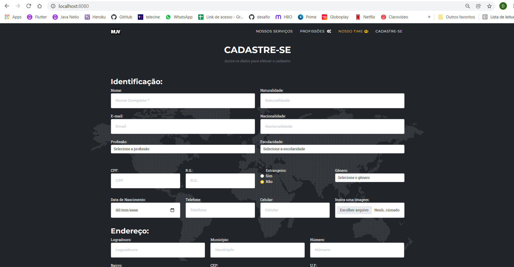
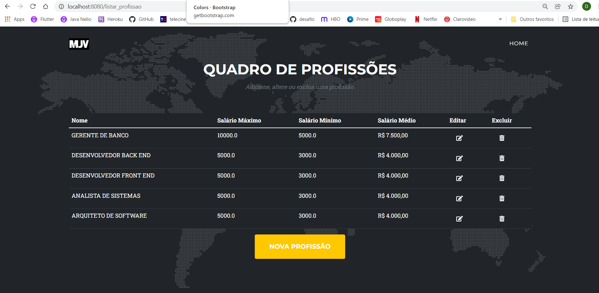

# Projeto Final Java MJV
## Easy Job

### Criação do Projeto

1. Criação do projeto através da extensão da IDE Eclipse **Spring Tools 4** obtido pelo recurso Eclipse Marketplace em detrimento do projeto através do **Spring Initializr** no site https://start.spring.io/. Optou-se por explorar ao máximo todos os recursos da IDE Eclipse
2. Import das dependências: *Spring Web*, *Spring Data JPA*, *PostgreSQL Driver*, *Thymeleaf* e *Spring Boot Dev Tools*; esta última para reinicializar a aplicação a cada salvamento. A dependência Spring Web foi utilizada para que a aplicação rode numa url com um servidor Tomcat, pois obviamente se trata de uma aplicação web. A dependência Spring Data JPA permite que sejam criados modelos para armazenamento em banco através do framework hibernate usando todos os recursos das anotações JPA. A dependência PostgreSQL é para acesso a um banco postgres previamente criado, isso requer uma configuração do arquivo [application.properties](mjv_easy_job/src/main/resources/application.properties) localizado na pasta resources do projeto. A dependência Thymeleaf nos permite usar esse framework para comunicação com páginas html, além de permitir uma maior facilidade aos recursos que estarão mapeados nas pastas template e static dem resouces.

### Criação do pacote Model
1. Criação das classes modelo no pacote model: [Cadastro](mjv_easy_job/src/main/java/mjv/easy_job/model/Cadastro.java), [Profissao](mjv_easy_job/src/main/java/mjv/easy_job/model/Profissao.java), [Escolaridade](mjv_easy_job/src/main/java/mjv/easy_job/model/Escolaridade.java), [Sexo](mjv_easy_job/src/main/java/mjv/easy_job/model/Sexo.java), [Endereco](mjv_easy_job/src/main/java/mjv/easy_job/model/Endereco.java), [UnidadeFederativa](mjv_easy_job/src/main/java/mjv/easy_job/model/UnidadeFederativa.java). 
2. O mapeamento foi feito sendo a Classe cadastro nossa principal tabela do banco easy_job onde além de atributos comuns como nome, email, cpf, também foram incluídos um atributo Endereco, outro Profissao, outro Escolaridade e Sexo. Com excessão dos enums (Escolaridade e Sexo), temos um mapeamento da classe Endereço que é um *@Embeddable*, ou seja, uma classe imbutível na tabela cadastro. Isso significa que todos os atributos de endereco, inclusive seu enum uf vão ser mapeados diretamente na tabela cadastro. 
3. Vale ressaltar que caso um cadastro pudesse ter vários endereços a melhor opção seria um mapeamento um para muitos, onde um cadastro possui vários endereços (*@OneToMany* do lado do cadastro). 
4. Também na tabela cadastro teremos uma chave estrangeira referente ao atributo Profissao. Graças ao JPA esse mapeamento, inclusive as configurações do *Hibernate* para criação e alteração das tabelas, torna-se uma tarefa que não exige a manipulação dos dados utilizando o SQL, apenas o conhecimento do comportamento da aplicação na atribuição de *anotations*. Os conceitos do SQL tornaram-se extremamente uteis à medida que foi necessário a lapidação das tabelas e suas colunas. Muitos testes foram feitos diretamente no banco usando o software Dbeaver para que fosse possível entender o código de erro gerado muitas vezes nesta experiência.

### Criação do pacote Repository
1. Foram criados dois repositories [CadastroRepository](mjv_easy_job/src/main/java/mjv/easy_job/repository/CadastroRepository.java) e [ProfissaoRepository](mjv_easy_job/src/main/java/mjv/easy_job/repository/ProfissaoRepository.java) onde cada um desses arquivos é uma interface que irá herdar de JpaRepository as funcionalidades do JPA inclusas em métodos com padrões de nomenclaturas como por exemplo: findAll(), getById(), etc... 
2. Também é possível a criação de métodos mapeados nessa interface para serem usadas ao evocarmos um repository através da anotação *@Autowired*. Essa anotação permite que todos os métodos da biblioteca JpaRepository fiquem disponíveis e a consulta ao banco seja abstraída do código SQL necessário para aquela query.

### Criação do pacote Service

1. Foram criadas duas classes Services: [ProfissaoService](mjv_easy_job/src/main/java/mjv/easy_job/service/ProfissaoService.java) e [CadastroService](mjv_easy_job/src/main/java/mjv/easy_job/service/CadastroService.java). 
2. Foi usado a anotação @Service para que o Spring boot reconhecesse e pudesse disponibilizá-lo em outros contextos. Também foi usado um repository com  @Autowired para que os métodos de manipulação de dados fossem evocados através da interface que herda de JpaRepository.
3. essas classes foram incrementadas no decorrer da aplicação observando-se a devida necessidade. A classe CadastroService conta com uma abundância de métodos para que a camada Controller continue ingênua apenas delegando aos respectivos responsáveis a atribuição de determinadas ações. Por esse motivo foi nessa classe que foi criado o método inserirCaminhoImagem onde recebemos um objeto Cadastro como parâmetro para manipularmos seu atributo MultipartFile file que está mapeado como um atributo transiente. A anotation *@Transient* indica ao JPA que aquele atributo não deve ser persistido no banco de dados, o que proporcionou uma manipulação do objeto fazendo com que esse atributo mais tarde indicasse o caminho do arquivo de imagem salvo através de um upload feito no formulário html. Em outras palavras, temos na classe Cadastro um atributo que é um tipo Multipart que é um arquivo recebido através do código html pela tag input com type="file", o qual o JPA não persistirá devido a caracterização de atributo transiente, e que será usado para salvar em disco um arquivo de imagem que terá seu caminho mapeado no banco para uso. Vale ressaltar que numa aplicação em produção esse arquivo será salvo no servidor. Futuramente no decorrer desse relato será explicado alguns detalhes da interação com a IDE que ocasionou lentidão no carregamento do arquivo na imagem, o que não acontecerá em produção.
4. Também foram criados métodos básicos para obtermos uma lista de cadastros, salvar um cadastro e obter um cadastro pelo id; métodos estes usados no Controller para a manipulação e exposição dos dados no front.

### Criação do pacote Controller

1. Optou-se pela criação de uma classe controller [EasyJobController](mjv_easy_job/src/main/java/mjv/easy_job/controller/EasyJobController.java) mapeada com a anotação *@Controller* e *@RequestMapping* para identificarmos o caminho da url que usaremos ao interagir com a página.
2. Neste ponto faremos a integração com o template html disponilizado pelo professor [Glayson Sampaio](https://github.com/glysns) utilizando o arquivo [index.html](mjv_easy_job/src/main/resources/templates/index.html)

### Utilizando Thymeleaf

1. A primeira providência para que os dados fossem exibidos na tela era que através do controller passemos uma lista de cadastros para que nas páginas html possamos renderizar nossas informações. Alem da criação de uma ModelAndView utilizamos a sintaxe th: nas tags HTML para indicar que queremos trazer dados do back end. Para isso foi incluída na indicada como <!-- Team --> numa div incluída setando th:each que possibilita a criação de uma estrutura de repetição.
2. Para a criação do formulário foi necessário primeiramente o entendimento de como deveríamos receber esses dados no back end e assim montar o método save, (url "/grava") no nosso controller. Neste ponto devemos salientar que uma gama de possíveis erros acontecem que podem ter relação com a estrutura do banco, como por exemplo uma validação no nosso modelo de condição not null que devemos tratar caso haja ações do front end. O conceito de validação demanda um estudo a parte de deve ser considerado tanto no back end, quanto no front end.
3. A inserção de selects para a profissão foi facilmente resolvida passando uma lista de profissões pelo controller. Porém a solução para um select de enums não foi tão trivial. Primeiro tentou-se a criação de métodos no CadastroService que trouxesse uma lista de strings dos enums. Depois, a partir de alguns estudos da sintaxe do Thymeleaf, percebeu-se que poderiam ser feitos diretamente no arquivo index.
```
<div class="form-group">
	<select class="form-control" name="escolaridade">
		<option value="null" disabled selected="selected">Escolaridade</option>
			<option
				th:each="escolaridadeOpt : ${T(mjv.easy_job.model.Escolaridade).values()}"
					th:value="${escolaridadeOpt}" th:text="${escolaridadeOpt.nome}"></option>
	</select>
</div>
```
Como é possível observar, o Thymeleaf possui um recurso de decodificação da classe possibilitando a obtenção dos valores em texto do enum em questão. O mesmo procedimento foi utilizado para todos os outros enums.
4. A inserção de dados através do método save traz um objeto Cadastro pela tag form onde o th:object indica o que vamos receber no back end. Nessa parte houve apenas um ponto de atenção a ser considerado que foi a interpretação que o Thymeleaf faz do objeto Profissão ao passar um id da profissão como valor é salva um cadastro com um objeto profissão em seu atributo como esperado, bem como na tabela obtemos o id da profissão como sua chave estrangeira.
#### Upload do arquivo de imagem
5. Também foi incluído no formulário HTML a possibildidade de upload de uma imagem usando para tanto o atributo transient (que não foi persistido no banco conforme a anotation @Transient) MultipartFile chamado de file que é uma representação do arquivo inserido pelo usuário. Dessa forma, o file é usado apenas no método save, quando o cadastro chega do formulário. Aí que entra o método inserirCaminhoImagem do CadastroService, onde recebemos um cadastro e desse cadastro utilizamos o atributo file para criarmos em disco um arquivo (uma cópia do arquivo do usuário), onde foi possível usar a classe Path aprendida em aula, e a classe Files. Basicamente o carquivo é decodificado em bytes e através do caminho disponível no servidor ou na máquina é salvo pelo Files.write. O arquivo uma vez salvo o método se encarrega de salvar o caminho desse arquivo no banco de dados no atributo String caminhoImagem para ser usado, esse atributo sim será persistido como outros atributos da classe cadastro. Um ponto de atenção nesse caso é que devido a IDE eclipse não sincronizar seu workspace com as mudanças feitas, o arquivo só é carregado na tela quando atualizamos o workspace na IDE, o que não aconteceria em produção, pois esse problema acontece apenas no desenvolvimento usando o eclipse.

#### Usando imagem default para masculino, feminino ou não binário.
6. Ainda no método inserirCaminhoImagem foi feito um adendo para que se usuário não inserisse imagem alguma, mesmo assim uma imagem pudesse ser mostrada. Temos um algoritmo simples que identifica o gênero e insere uma imagem prévia de um usuário ou uma usuária - ou um usuário neutro caso o gênero seja não binário. Essas imagens (10 no total) já estão salvas na aplicação na pasta assets/img/team, assim como quaisquer imagens porventura inseridas por usuários.
7. Outro método criado para carregar um cadastro em outra página foi o verCadastro na classe de controller utilizando o @PathVariable para indicar que será carregada uma página com o id do cadastro. No link que faz a mudança de página que é uma tag a, foi inserido th:href com a informação da url e o id. A partir do mesmo princípio podemos fazer outra página para editar o usuário.


### Fazendo um CRUD completo de um cadastro

1. Na explanação sobre o Thymeleaf foi explicado como fazemos para criar um novo cadastro e fazer um select que retornará uma lista de cadastro que será mostrada dinamicamente na tela. Agora para termos completo controle sobre um cadastro devemos poder editar e excluir esse cadastro.
2. Antes de editar foi criado uma tela para ver o cadastro com as informações atuais [ver_cadastro.html](mjv_easy_job/src/main/resources/templates/ver_cadastro.html) com um formulário preenchido para que fosse estudado a melhor forma de mostrar esse cadastro para futura edição. Essa tela é acessada no link da tag a abaixo do cadastro com um ícone de visualização com acesso pelo th:href. Foram então criados 3 ícones, visualizar, editar e apagar.
#### Formulário de um cadastro

3. Depois foi criada a tela de edição do cadastro com [editar.html](mjv_easy_job/src/main/resources/templates/editar.html).
4. Na classe [EasyJobController](mjv_easy_job/src/main/java/mjv/easy_job/controller/EasyJobController.java) foram criados os métodos correspondentes para navegar entre as páginas carregando o id do cadastro para edição e exclusão, e métodos para sumeter os formulários respectivos.
5. O CRUD ficou completo com o método excluirCadastro onde na tag a colocamos um método js que escuta o evento onclick para que um alert de confirmação seja mostrado na tela antes que o cadastro seja excluído. Uma nova sintaxe do thymeleaf com th:attr também foi ustilizada para que pudéssemos colocar na mensagem do alert uma variável conforme o código abaixo:
```
<a class="btn btn-dark btn-social mx-2" th:href="@{/excluir/{id}(id=${c.id})}" 
	th:attr="onclick=|return confirm('Você tem certeza que deseja excluir a ficha de ${c.nome}?')|" >
	<i class="fas fa-trash-alt"></i>
</a>
```
### CRUD completo da tabela profissão
#### Formulário profissão



1. criação dos arquivos [profissoes](mjv_easy_job/src/main/resources/templates/profissoes.html), [form_profissao_alterar](mjv_easy_job/src/main/resources/templates/form_profissao_alterar.html), [form_profissao](mjv_easy_job/src/main/resources/templates/form_profissao.html) para listar, alterar e deletar uma profissão do banco de dados.


